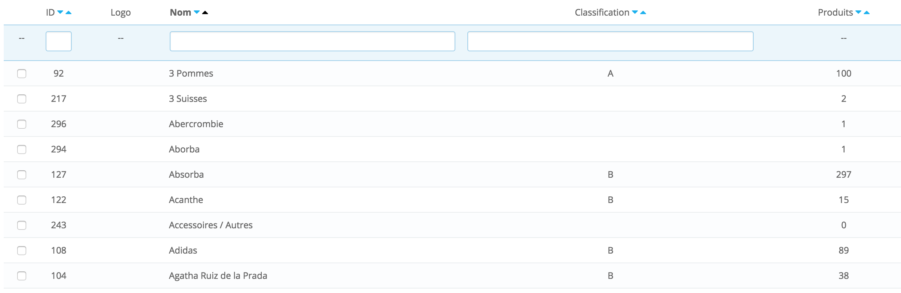

## 1. Présentation

[**RoseIndigo.com**](http://www.roseindigo.com/) est un site e-commerce de vente **de vêtements d’occasion pour enfants de la naissance à 12 ans**. Le site a été créé en Octobre 2010 sur une base de Prestashop 1.3 et entièrement redeveloppé il y a 1 an sous Prestashop 1.6

## 2. Besoin

Création d'un module de promotions et intégration de deux modules permettant respectivement de créer des offres et d'afficher des bannières de promotions dans les pages catégories.

Nous avons déjà un module promotions mais qui ne fonctionne pas comme prévu, nous allons le recréer de manière différente afin de simplifier les choses. Nous l'avons séparé en trois parties, 

1. Soldes et promotions
2. Réductions Commerciales 
3. Affichage des bannières 

## 3. Développement module Soldes et promotions

Un module capable de passer en promotions ou en soldes un large catalogue de produits.

La création d'une promotion se déroule en 3 étapes :

- **1:** Filtrage des produits 
- **2:** Application de la promotion 

### 3.1 Filtrage

Le catalogue doit pouvoir être filtré sur l'ensemble des catégories niveau 1,2 et 3 ainsi que sur les caractéristiques et les marques ou les classifications de marques ET avec toutes les combinaisons possibles.

> Exemple de filtrage produit: 

- vêtements filles + été + T-shirt
- 3 ans + été 
- filles + 6 ans + T-shirt + été
- garçons + 6 mois + Pantalon + impeccable
- tout le site - marques classification A
- filles + hiver - marques classification B & C 
- marques DPAM
- Marque Petit Bateau + été
- L'ensemble du site (environ 5000 produits)

### 3.2 Application de la promotion

Les paramètres suivant peuvent être appliqués aux produits filtrés:

- X% de remise
- Date de début
- Date de fin
- Soldes OU promotions

## 4. Intégration module Réductions Commerciales

Intégration du module de promotions [Module	Maxi-Promos - Promotions et Réductions Commerciales](http://addons.prestashop.com/fr/prix-promo-modules-prestashop/3462-maxi-promos-promotions-et-reductions-commerciales.html) qui sera acheté par nos soins.

## 5. Intégration module bannière

Intégration  [Module	Bannières multiples](http://addons.prestashop.com/fr/fonctionnalites-front-office-modules-prestashop/9360-bannieres-multiples.html) qui sera acheté par nos soins.

Une modification sera peut être nécessaire pour afficher chaque bannière dans notre rubrique [promotions](http://www.roseindigo.com/promotions) listant toutes les promotions en cours.

## 6. Composition de notre catalogue

> Composition des path de catégories

racine du site | / catégories niveau 1 | catégories niveau 2 | catégories niveau 3 | filtres
 ------------- | ------------ | ------------ | ------------ | ------------ | 
/ | sexe/ | taille/ | dressing/ | ?filtres1&filtres2| 

>catégories niveau 1

niveau 1| PRODUITS
------------ | ------------- 
filles 	| Affiche les produits pour filles
garçon 	| Affiche les produits pour garçons

| Affiche les produits pour filles ET garçons

>catégories niveau 2

niveau 2| PRODUITS
------------ | ------------- 
1 mois 	| Affiche les produits taille 1 mois
3 mois 	| Affiche les produits taille 3 mois
6 mois 	| Affiche les produits taille 6 mois
...		| etc
-	 	| Affiche les produits de toutes tailles

>catégories niveau 3

niveau 3 | PRODUITS
------------ | ------------- 
T-shirt | Affiche tous les tee-shirts
Robe 	| Affiche toutes les robes
...		| etc

| Affiche les produits de toutes sortes (dressing)

>Filtres

filtre | filtre | filtre | filtre | filtre | filtre
------------ | ------------ | ------------ | ------------ | ------------ | ------------ |
?marque= | &qualite= | &saison= |  &page= | &nb_restult= | &tri=(prix croissant/décroissant/nouveaut/anciens)

> Marques

Les marques ont une classification A,B,C ou D:

